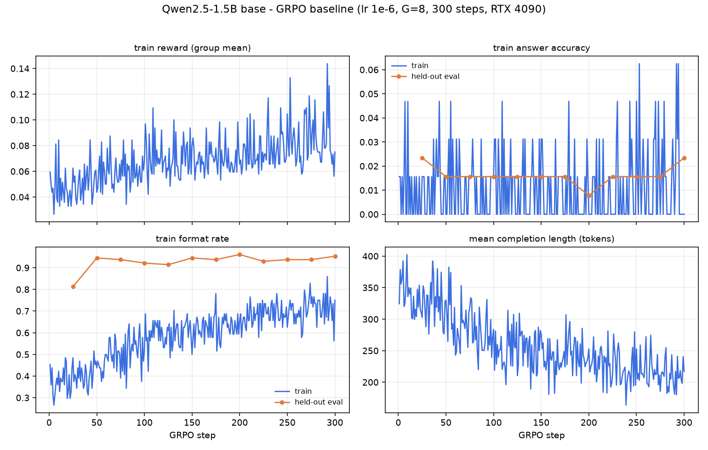
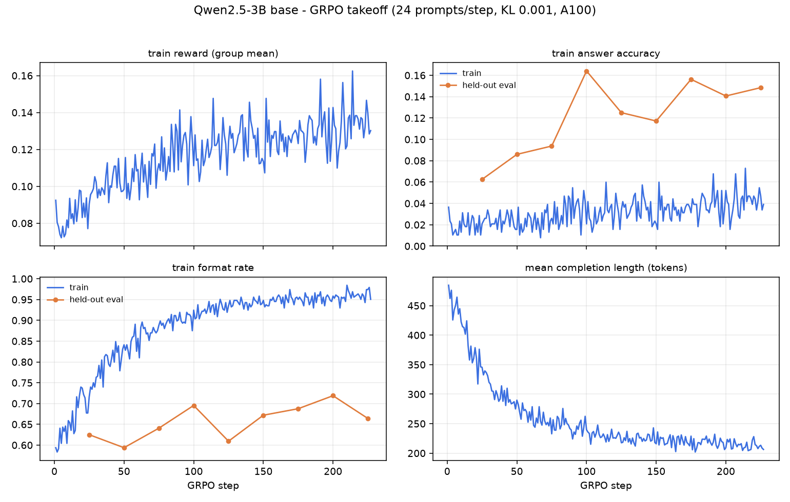

# countdown-grpo

From-scratch GRPO (Group Relative Policy Optimization) in PyTorch +
`transformers`, applied to the Countdown arithmetic task. A replication
study in the style of TinyZero's R1-Zero reproduction: start from a base
model, reward only outcome + format, and watch search-style reasoning
develop in the completions.

No TRL, no verl, no vLLM: the rollout sampling, group-relative advantages,
clipped token-level policy loss, and training loop are all implemented
here, in about a thousand lines, so every design decision is visible and
testable.

## What "replication" means here (and what it does not)

- This repo makes **no emergence claims**. Self-reflection phrasing
  ("wait, let me reconsider") already exists in Qwen2.5 *base* models
  before any RL — measured here, not just asserted: **36.7%** of base
  Qwen2.5-0.5B completions already use verification / backtracking /
  enumeration language at step 0, while answer accuracy is **0.0%** (see
  [Step-0 behavioral analysis](#step-0-behavioral-analysis-base-model-no-rl)
  below). So RL *amplifies* pre-existing reasoning language rather than
  creating it. The claim being replicated is narrower and measurable:
  outcome-reward GRPO lifts Countdown accuracy from near-zero to a nontrivial
  level at 1.5B-3B scale, with the known reward curve shape (format first,
  then accuracy).
- Qwen2.5-0.5B is used only for pipeline debugging: TinyZero reports it
  fails to learn Countdown from zero RL, and nothing here contradicts that.
- Implementation and tests are done and green (below). The GPU training
  runs have not happened yet; `RUNBOOK.md` is the exact procedure and
  budget for them.

## Task

Given 3-4 numbers and a target, emit reasoning in `<think>` tags and an
arithmetic expression in `<answer>` tags that uses each number exactly
once and equals the target. Puzzles are generated by composing random
integer-exact operations, so every puzzle is solvable by construction;
the dataset is deduped and the eval split is excluded from training.

The reward never executes model output. Answers are parsed with `ast`
and evaluated over an explicit whitelist (integer literals and `+ - * /`
only — no names, calls, attributes, subscripts, unary ops, or floats),
with exact rational arithmetic via `fractions.Fraction` and a strict
each-number-used-exactly-once multiset check. Reward is tiered
(TinyZero-style): 1.0 for a correct answer, 0.1 for correct tag format,
0 otherwise; a format-free `answer_only` mode exists as an ablation.

## Design notes

- **Zero-variance groups**: when all G completions in a group score the
  same, the group-normalized advantage is 0/0 up to epsilon. Those
  advantages are set to exactly 0, and the sequences are dropped from the
  update by default (`loss.filter_degenerate`).
- **KL is optional**: `loss.kl_beta: 0` (default) trains without a
  reference model, GRPO-Zero style. When enabled, KL uses the k3
  estimator against a frozen copy of the initial policy.
- **Dr. GRPO knobs** (arXiv 2503.20783): `loss.adv_use_std: false`
  removes the std normalization, `loss.agg: drgrpo` replaces the
  per-sequence length normalizer with a constant — both length-bias
  corrections, exposed as ablations.
- **Masked-before-exp**: log-ratios are zeroed at prompt/padding
  positions before exponentiation, so garbage logprobs at masked
  positions cannot poison the loss with `inf * 0 = nan`.
- **Fail loudly**: a non-finite loss raises immediately rather than
  silently corrupting a paid run.

## Layout

```
src/grpo/
  countdown.py   puzzle generator, prompt templates, safe reward
  rollout.py     batched sampling, action masks, per-token logprobs
  advantage.py   group-relative advantages (+ Dr. GRPO variant)
  loss.py        clipped token-level surrogate, optional KL, agg modes
  train.py       config-driven loop: rollout -> advantages -> updates
  models.py      HF loading; offline tiny-random model + char tokenizer
  config.py      dataclass configs, YAML loading
configs/         debug (CPU), 0.5B MPS smoke, 1.5B/3B GPU configs
tests/           70 tests, all CPU, no downloads
scripts/         one-off real-model smoke test
RUNBOOK.md       the paid-GPU procedure: costs, milestones, ablations
```

## Quickstart

```bash
uv sync
uv run pytest -q                                          # ~30s, all CPU
uv run python -m grpo.train --config configs/debug_tiny_cpu.yaml
uv run python scripts/smoke_qwen.py                       # downloads 0.5B, runs on MPS
```

## Testing

`uv run pytest` runs in ~30s on a laptop with no downloads. Highlights:

- Reward: valid solutions accepted; number reuse/omission rejected;
  `__import__`/`getattr`/`__class__`/call/subscript injections rejected;
  division handled exactly (`7 / 2 * 4 = 14` accepted, `10 / 3 != 3`);
  malformed tags degrade to format-only or zero.
- Advantages: hand-computed group values; zero-variance guard.
- Loss: prompt tokens provably contribute zero loss and zero gradient;
  clip behavior checked at all four ratio/advantage boundaries against
  hand-computed values; KL=0 path identical to the no-reference path.
- **End-to-end policy improvement**: a tiny random model is trained for
  30 GRPO steps against a rigged reward (+1 for emitting the character
  `z`). The policy's probability of the rewarded token rises from 0.010
  to 0.235 (23.6x) and the group reward rate goes 0.34 -> 1.00. This
  test runs the full production code path (generate -> mask -> old
  logprobs -> group advantages -> clipped minibatch updates) in ~3s on
  CPU, and is the strongest single check that the machinery does policy
  improvement.

## Status

- [x] GRPO implementation (rollout, advantage, loss, train loop)
- [x] Safe Countdown reward + puzzle generator
- [x] Test suite green, including e2e policy improvement
- [x] Local real-model smoke on MPS (Qwen2.5-0.5B, see below)
- [x] Step-0 behavioral analysis — self-reflection language pre-exists in the base model (measured, see below)
- [x] 1.5B baseline run on a rented 4090 — **completed, honestly flat** (format learned, accuracy did not take off; measured result + diagnosis below)
- [x] Signal-density measurement across model scales + reference re-read → revised 3B config (below)
- [x] **3B headline run on a rented A100 — takeoff reproduced**: held-out accuracy 2.3% → **16.4% peak** (7×), plateauing ~12–16% by step 225 (measured result below)
- [ ] 1.5B tuned rerun (`configs/qwen15b_4090_v2.yaml`; aborted at 26/300 steps on budget)
- [ ] Ablation matrix (group size, KL, reward decomposition) — future GPU budget

### MPS smoke result (Qwen2.5-0.5B base, untrained)

`scripts/smoke_qwen.py` on an M2 Pro (16GB): 8 rollouts of up to 256
tokens sampled in 19.6s on MPS. On the untrained base model with the r1
template: reward mean 0.013, format rate 0.125 (1 of 8 completions
already produces well-formed `<think>/<answer>` tags, consistent with
oat-zero's observation that the format pre-exists in the base model),
answer rate 0.000. Reward extraction, masking, and logprob bookkeeping
all behave on real generations.

### Step-0 behavioral analysis (base model, no RL)

Does the "aha moment" come from RL, or is it already there?
`scripts/behavioral_step0.py` samples the **untrained** base model on 128
Countdown prompts (r1 template, M2 Pro / MPS, ~3.5 min) and counts
cognitive-behavior language in what it generates *before a single gradient step*:

| metric (base Qwen2.5-0.5B, 128 completions) | value |
| --- | --- |
| answer accuracy | **0.0%** |
| well-formed `<think>/<answer>` | 14.8% |
| **any** verification / backtracking / enumeration language | **36.7%** |
| — verification ("check", "is this right", "which equals") | 25.0% |
| — enumeration ("let me try", "another way", "what if") | 18.0% |
| — backtracking ("wait", "actually", "instead") | 5.5% |

The base model already self-checks and revises — e.g. *"25 + 48 = 73 and then
73 / 11 = 6.63… (as you can see, the answer is not exact… to make it closer to
62, I can multiply…)"* — while solving **none** of the puzzles. So the reasoning
*language* pre-exists (the oat-zero / SimpleRL-Zoo observation, reproduced on
this model); RL's job is to make that behavior *effective*, not to invent it.
This is why a rising response length during training is not, by itself, evidence
of emergence — and why the headline run is scored on **accuracy**, not length.

Caveats: the rates are a lexicon-based proxy (conservative word-boundary
patterns, counted only in the completion, not the prompt), and 0.5B is the
weakest base model — running the same script on the 1.5B/3B checkpoints is part
of the GPU runbook. Reproduce: `uv run python scripts/behavioral_step0.py`.

## 1.5B GPU baseline (measured — honestly flat)

One full baseline run on a rented RTX 4090 (Qwen2.5-1.5B base,
`configs/qwen15b_4090.yaml` unmodified: lr 1e-6, G=8, 300 steps, ~41 s/step,
~3.5 h, ~$3 of compute):



| held-out eval (greedy, 128 puzzles) | step 25 | step 50 | step 150 | step 300 |
| --- | --- | --- | --- | --- |
| format rate | 0.812 | 0.945 | 0.945 | **0.953** |
| answer accuracy | 0.023 | 0.016 | 0.016 | **0.023** |

**What happened:** the first half of the classic R1-Zero curve reproduced on
schedule — well-formed `<think>/<answer>` output was learned by step 50 and held
at ~95%. The second half did not: answer accuracy stayed at the base model's
~2% for all 300 steps. Raw data: `docs/runs/qwen15b_baseline_metrics.jsonl`.

**Diagnosis** (from the run's own telemetry, not speculation):

- `clip_frac ≈ 0.0005` all run — updates never approached the PPO trust-region
  boundary, i.e. lr 1e-6 (the stability-first setting from the references) is
  far too timid at this scale to compound the sparse successes.
- The solve signal is structurally sparse at 1.5B: at a ~1% answer rate, a
  group of G=8 completions contains a correct answer ~8% of the time, and once
  format saturates, the remaining groups carry near-zero advantage variance.
  RL can only amplify what sampling finds, and 1.5B rarely finds a solution.

**Follow-ups:** the tuned config attacking exactly those two levers
(`qwen15b_4090_v2.yaml`: lr 3e-6, G=16, temperature 1.1) was launched and
aborted at 26/300 steps for budget — too early to conclude anything
(partial metrics committed). The 3B run (`qwen3b_a100.yaml`) is the scale the
reference milestones were calibrated on and remains the planned headline.
This section stays in the README either way: a flat baseline with a measured
diagnosis is the control arm, not a failure.

## Why 1.5B stayed flat: measured signal density

GRPO's solve gradient exists only in groups that contain at least one — and
not all — correct completions. `scripts/solve_rate_by_difficulty.py` measures
how often that happens for the **untrained base model**, per difficulty slice
(G=8 samples per puzzle, r1 template, MPS; raw JSON in `docs/runs/`):

| slice | 1.5B-base signal@8 | 3B-base signal@8 |
| --- | --- | --- |
| 3 numbers, values ≤30 | 0.0% | 12% |
| 3 numbers, full range | 2.1% | **28%** |
| 4 numbers | 0.0% | 3% |

Base 1.5B produces essentially nothing to amplify on *any* slice — including
the easiest — which closes the case on the flat baseline (and rules out both a
difficulty curriculum and hyperparameter rescues at this scale: the fuel tank
is empty). Base 3B has real fuel on 3-number puzzles, a meaningful difficulty
gradient (28% vs 3%), and a much higher zero-shot format rate (~51% vs ~29%).
At the revised A100 config (G=16, 24 prompts/step) that is roughly 7–9
informative groups per step versus the baseline run's ~0.5. If the mixed
(3,4) task still stalls, training on 3-number puzzles first (config knob
`data.num_counts`) is now an evidence-backed curriculum, not a guess.

## What the references actually did (and where this repo deviated)

Re-reading the sources after the flat baseline, the successful runs differ
from this repo's run 1 more than the "TinyZero-style" shorthand suggests:

| | algorithm | model | prompts/update | KL | outcome |
| --- | --- | --- | --- | --- | --- |
| TinyZero | **PPO + critic** | 3B **base** | **256** | 0.001 | takeoff |
| philschmid mini-R1 | GRPO (TRL) | 3B **Instruct** | ~8 | 0.001 | 25%@100 |
| GRPO-Zero | GRPO, no KL | 3B **Instruct** | ~32 | 0 | works |
| this repo, run 1 | GRPO, no KL | 1.5B base | 8 | 0 | flat |

Three observations. TinyZero's headline script is PPO with a learned critic —
every token gets a value-function gradient, so the group-sparsity failure mode
of GRPO doesn't apply, and its batch (256 prompts/update) finds correct
samples every step even at a low solve rate. The GRPO successes started from
Instruct models, i.e. with high signal density from step one. And DAPO
(arXiv:2503.14476) formalizes exactly the failure observed here — degenerate
groups carry zero gradient under centering — fixing it by resampling until the
batch is full of informative groups. Run 1 sat outside every reference's
demonstrated envelope on three axes at once (GRPO + small batch + small base
model); the revised `qwen3b_a100.yaml` (3B, 24 prompts/step, KL 0.001) moves
back inside it while keeping the base-model R1-Zero framing.

## 3B takeoff (measured — the headline run)

Qwen2.5-3B **base** on a rented A100-80GB, `configs/qwen3b_a100.yaml` as
committed (24 prompts × G=16 = 384 sequences/step, KL 0.001, lr 1e-6,
~350 s/step, ~$31 of GPU). Run ended at step 227 when the rental credit ran
out — after 125 steps of plateau, so nothing was left on the table. Raw
metrics: `docs/runs/qwen3b_a100_metrics.jsonl`.



| held-out eval (greedy, 128 puzzles) | step 25 | 50 | 75 | **100** | 125 | 150 | 175 | 200 | 225 |
| --- | --- | --- | --- | --- | --- | --- | --- | --- | --- |
| answer accuracy | 6.2% | 8.6% | 9.4% | **16.4%** | 12.5% | 11.7% | 15.6% | 14.1% | 14.8% |
| format rate | 62% | 59% | 64% | 70% | 61% | 67% | 69% | 72% | 66% |

**The takeoff is real and the diagnosis held.** The same trainer that stayed
flat at 1.5B (2.3% for 300 steps) lifted 3B from a 2.3% zero-shot baseline to
a 12–16% band — first eval already at 6.2%, peak 16.4% at step 100 — because
3B's measured signal density (28% of groups informative on 3-number puzzles)
gives GRPO something to amplify. Accuracy then oscillates rather than
compounding further: at ~4% temperature-1.0 solve rate, informative groups
remain a minority, and the ±3% band is consistent with eval noise (n=128)
around a slow grind. The references that pushed higher used an Instruct base,
a critic, or dynamic resampling — all documented above as the next levers.

Honest caveats: one seed, one run; peak vs. plateau reported separately
(16.4% peak, ~14% settled); completion length *shrank* (485 → ~210 tokens)
while accuracy rose — on Countdown, efficient search beats long rambling,
which is another reason response length is a poor proxy for reasoning.

## References

- DeepSeekMath: GRPO — arXiv:2402.03300
- DeepSeek-R1 (R1-Zero recipe) — arXiv:2501.12948
- TinyZero — github.com/Jiayi-Pan/TinyZero, public curves at
  wandb.ai/jiayipan/TinyZero
- GRPO-Zero — github.com/policy-gradient/GRPO-Zero (no-KL variant)
- nano-aha-moment — github.com/McGill-NLP/nano-aha-moment
- Dr. GRPO: "Understanding R1-Zero-Like Training" — arXiv:2503.20783
- oat-zero: "There May Not Be Aha Moment in R1-Zero-Like Training" —
  github.com/sail-sg/oat-zero (why this repo avoids emergence claims)
- philschmid mini-R1 blog (Countdown GRPO milestones and stable KL/lr
  settings) — philschmid.de/mini-deepseek-r1
